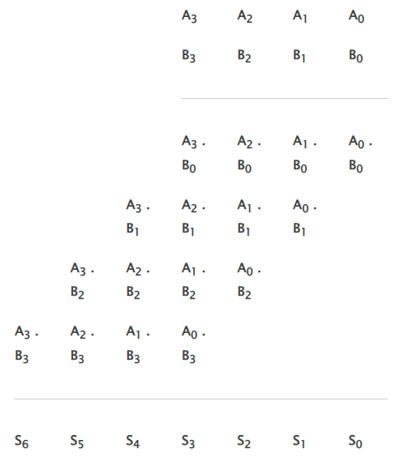
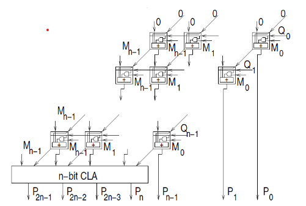

### Theory

## Design of Combinational Multipliers

Combinational Multipliers do multiplication of two unsigned binary numbers.Each bit of the multiplier is multiplied against the multiplicand, the product is aligned according to the position of the bit within the multiplier, and the resulting products are then summed to form the final result. Main advantage of binary multiplication is that the generation of intermediate products are simple: if the multiplier bit is a 1, the product is an appropriately shifted copy of the multiplicand; if the multiplier bit is a 0, the product is simply 0.

The design of a combinational multiplier to multiply two 4-bit binary number is illustrated below:

If two n-bit numbers are multiplied then the output will be less than or equals to 2n bits.

**Some features of the multiplication scheme:**
 - it can be designed by unrolling the multiplier loop
 - instead of handling the carry out of partial product summation bit,the carry out can be sent to the next bit of the next step
 - this scheme of handling the carry is called carry save addition
 - this scheme is more regular and modular

 **Logic diagram:**

 

