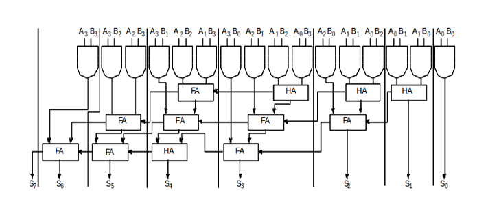

## Circuit Diagram of Combinational Multiplier:

## Components Needed:
To build a Combinational Multiplier, we need :
1. 16 2-input AND Gates
2. 4 half adders
3. 8 full adders
4. Display unit to show the outputs.
5. Wires to connect.

- Follow the below manual and perform the experiment
    - Manual --> [Click Here](./simulation/coavlNew.pdf)

<embed src="./simulation/coavlNew.pdf" type="application/pdf">

